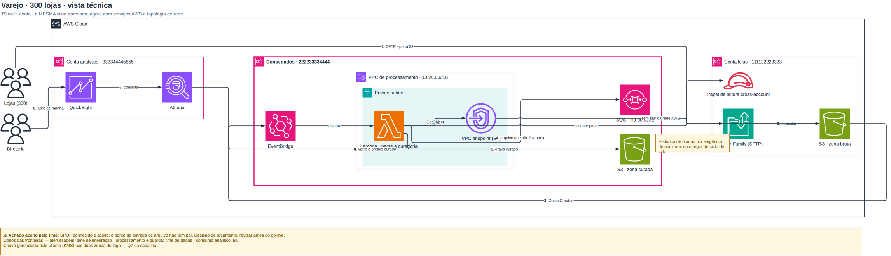
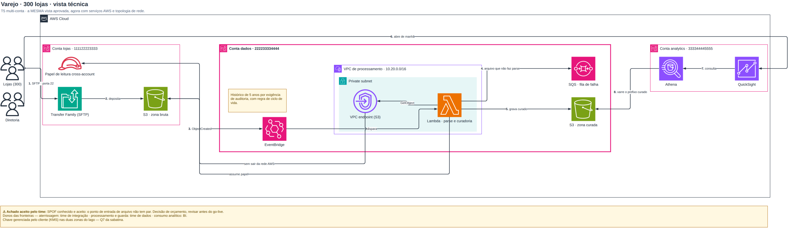

# O roteamento de aresta do #24 — o que o olho viu, e o que o número achou

O [#14](https://github.com/ThiagoPanini/panlabs-skills/issues/14) fechou com a
vista técnica **reprovada numa inspeção humana** e a suíte verde. O
[#18](https://github.com/ThiagoPanini/panlabs-skills/issues/18) deu nome ao que
o olho tinha visto — `A3.5` ×6, `A3.4` ×4, `A5.1` 5 cruzamentos, `A5.5` ×5. O
[#12](https://github.com/ThiagoPanini/panlabs-skills/issues/12) melhorou e não
fechou a conta, e **pagou parte da melhora em colisão de rótulo**. O
[#23](https://github.com/ThiagoPanini/panlabs-skills/issues/23) rodou o
validador sobre o corpus e achou a mesma família num segundo lugar
(`web-fluxo-3-az`, `A5.5` ×2), pôs em quarentena e nomeou o dono: este ticket.

Este documento é o laudo do conserto. Ele existe porque o ticket pede uma coisa
que nenhum comentário de fechamento tinha entregado antes: **o laudo completo
antes/depois, sem checagem trocada por outra em silêncio.**

## 0. A inspeção humana, antes e depois

A vista técnica do `varejo · 300 lojas` — página consolidada, o desenho que
reprovou no #14. O primeiro `.drawio` é reproduzível a partir de qualquer commit
anterior a este; o segundo sai de `node tools/aprovar.cjs && node tools/retomar.cjs`.

**Antes** — a fileira lida de trás para frente (`analytics | dados | lojas`), a
nota da retenção largada em cima do Transfer Family e da borda da conta, "8.
varre o prefixo curado" por cima do rótulo do Lambda, "sem sair da rede AWS" por
cima do SQS, e o "VPC endpoint (S…" cortado pelo rótulo que passa por ele:



**Depois** — `lojas → dados → analytics`, a nota dentro da conta a que ela se
refere e com espaço reservado, e nenhuma seta por cima de ícone ou de rótulo:



## 1. O orçamento, e onde ele fechou

| checagem | no #14 | depois do #12 | na árvore do #23 | orçamento | **agora** |
|---|---|---|---|---|---|
| `A5.5` aresta cruza fronteira alheia | ×5 | ×2 | ×2 (+×2 no corpus) | **0** | **0** |
| `A3.5` aresta sobre ícone | ×6 | ×2 | ×2 | 0 | **0** |
| `A3.4` aresta sobre rótulo | ×4 | ×5 | ×4 | 0 | **0** |
| `A5.1` cruzamentos | 5 | 2 | 1 | ≤ 2 | **1** |

Reproduzir:

```bash
cd skills/panlabs-aws-diagrams
node tests/check-roteamento.cjs          # o orçamento, como teste
node tools/medir-roteamento.cjs          # o laudo completo, uma linha por checagem
```

## 2. A hipótese do ticket, testada — **funcionou, e sozinha não bastava**

O #14 tinha deixado o candidato escrito: *"`dados: "volta"` é semântico, mas o
layout ordena pela seta"*. A hipótese era dar `dados` ao ELK como dica de
reversão.

**Ela funciona, e o número é este.** Aplicada sozinha, sem mais nada:

| | antes | só com a reversão |
|---|---|---|
| ordem das contas | `analytics → dados → lojas` | **`lojas → dados → analytics`** |
| `A5.5` na vista técnica | ×2 | **0** |
| `A5.1` na vista técnica | 1 cruzamento | **0** |
| `A3.4` na vista técnica | ×4 | ×2 |
| `A3.5` na vista técnica | ×2 | **×3** |
| falha semântica na vista **lógica** | 0 | **×1 (`A4.2`)** |
| falhas no corpus inteiro | 146 | **147** |

Ou seja: **resolve exatamente o que foi proposto para resolver, e sozinha é uma
troca ruim.** Ela mexe o desenho o bastante para expor um defeito que estava
escondido embaixo — a nota presa a nó, que o motor largava num offset fixo sem
reservar espaço. Só depois que a nota entrou no layout é que a reversão virou
ganho líquido.

O custo do desempate merece o nome: o `ordemDeContas` varria as 6 permutações
medindo **pulo** e **contramão** pela SETA. Duas consultas (`painel → consultar`
e `consultar → reter-objeto`, as duas `dados: "volta"`) puxavam a conta de
analytics para a esquerda, e a fileira inteira saía lida de trás para frente com
**custo 1** — o mesmo custo da ordem certa. Não era o varredor que estava
errado; era o que ele media.

A conta passou a ser do DADO (`dispor.sentidoDeLeitura`), e a seta continua a do
modelo (`dispor.desreverter` desfaz a reversão antes de qualquer consumidor ver
a aresta). São duas perguntas diferentes — *quem inicia* e *para onde o dado
vai* — e agora cada uma é respondida pelo campo que a responde.

## 3. As sete causas, uma a uma

Nenhuma delas foi achada por leitura de código. Todas saíram de medir, e a
última saiu de **olhar o PNG**.

**1 · A ordem das contas media a seta, não o dado.** `motor/dispor.cjs`,
`ordemDeContas`. Acima.

**2 · O desvio da grade caía dentro da coluna do meio.** `arestasNaGrade`
calculava a perna perpendicular como `(o.x + o.w + dst.x) / 2` — o ponto médio
entre os **ícones**. Num grid 3×3 esse ponto cai dentro do container vizinho: a
perna estava em `x=538` e o grupo `app-a` ia até `x=539`. Virou
`dispor.corredorLivre`, que não faz média nenhuma: junta os obstáculos que a
perna atravessaria, olha os vãos entre eles, e pega o mais perto do lado da
origem — que é a regra do #21 escrita em geometria em vez de em prosa.

**3 · A grade escrevia waypoint em coordenada da nuvem numa célula da camada.**
As caixas da grade saem relativas à nuvem (é assim que a faixa de AZ e a VPC são
emitidas, com `pai: idNuvem`); a aresta ia para `pai: '1'`, onde o waypoint é de
página. Ninguém somava `(mo.x, mo.topo)`, e o desvio saía deslocado das pontas
que o próprio motor tinha ancorado — **um traçado ortogonal por construção
virava diagonal**. Não era invisível: `A5.4` reportava *"dobra de 44,4°, abaixo
do piso de 60°"* e `A5.6` *"há segmentos fora dos eixos num roteamento que se diz
ortogonal"*. Duas checagens apontando para o mesmo `+32,+76` que ninguém tinha
somado.

**4 · A nota presa a um nó não era nada para o layout.** Era desenhada depois de
tudo, em `{ x: no.x + no.w + 14, y: no.y, w: 190, h: 46 }` — um chute sobre
espaço que ninguém tinha reservado. Na vista técnica isso valia `A4.2` ×3 e
`A4.4` ×1, as duas **semânticas** (a nota afirmando pertencer a uma conta e a uma
nuvem de que não é membro), mais `A3.5`, `A3.4` e `A3.2` porque a aresta que
ninguém avisou passava por dentro dela. Agora ela é um nó do ELK
(`dispor.notasPorPai`), filha do container do sujeito. As cinco caem por
**construção**: o ELK não sobrepõe nós, não tira filho de dentro do pai, e
desvia do que conhece. Nenhuma foi mirada.

**5 · A canaleta saía do nó sem perguntar se o lado estava limpo.** `ladoLivre`
media os dois lados e, quando nenhum servia, devolvia *"o mal menor é o curto"* —
**calado**. Foi assim que `a-confia` (Lambda → papel cross-account) saiu por
dentro do VPC endpoint. Agora ele devolve `{ lado, limpo }`, e quando os dois
lados estão sujos a aresta desce direto para a canaleta (`verticalLimpa`). O #12
tinha escrito que *"sair pela vertical era o caminho curto e era o errado"* — e
estava certo como regra, não como lei: descer é errado quando há irmão embaixo, e
é o único caminho limpo quando os dois lados estão ocupados e o vão de baixo não
está. Quem decide é a medida.

**6 · A canaleta de cima subia do centro do nó.** E o centro do nó é justamente
onde mora o vizinho, quando os atores estão empilhados: a "Diretoria" subia por
dentro das "Lojas (300)". A saída passou a ser pelo LADO, mesma inversão que o
#12 já tinha feito na canaleta de baixo. O `corredorLivre` entrou junto e vale
dizer o que ele mede aqui: **no corpus de hoje ele devolve a preferência
intacta em todas as chamadas deste caminho** — quem pagou `A3.5`/`A3.4` foi a
saída pelo lado, e ele fica como guarda para o caso de dois atores lado a lado.
Medir a diferença entre as duas coisas é o que evita um comentário que promete
mais do que o código faz.

**7 · O ELK não sabia que a folha tem rótulo.** O rótulo de uma folha é
desenhado FORA da caixa dela, e a caixa não pode ser inflada para caber o texto
(o ELK roteia até o centro, e um centro deslocado faz a seta sair de dentro das
letras). A saída anterior era o motor COMPRAR o espaço por fora, somando
`rotuloMax` no `spacing.nodeNode` e no `padding.bottom`: isso separa VIZINHOS e
não faz mais nada — o roteador de aresta continuava sem saber que há texto ali,
e passava por cima. Era `A3.4` e metade do `A3.2`, nas duas páginas em que o VPC
endpoint aparece.

A alavanca sempre esteve no ELK: `elk.nodeLabels.placement =
[H_CENTER,V_BOTTOM,OUTSIDE]` reserva o rótulo FORA da caixa — o centro continua
sendo o do ícone e o roteador desvia do texto. **E a reserva manual saiu junto**,
senão as duas pagariam o mesmo espaço duas vezes: medido, com as duas a
`landing-zone` sai 1903×997; só com o ELK, **1903×861** — 136 px mais baixa que
com as duas, e 41 mais baixa que os 1864×902 de antes de tudo (39 px mais larga,
porque o rótulo agora entra na conta da largura em vez de vazar). O ganho não é só de altura — `A4.5` (padding de grupo
uniforme) melhora em seis páginas, porque quem calcula o padding passou a ser
quem sabe de que tamanho é o conteúdo.

## 4. A oitava causa, que **nenhuma checagem pegou**

Com as sete acima o orçamento fechou e a suíte ficou verde. O render mostrou um
toco de linha pendurado abaixo do "8. varre o prefixo curado", com o rótulo
boiando no meio dele.

Entre duas contas vizinhas separadas por uma `CALHA`, sair pela direita de uma e
pela esquerda da outra dá **exatamente o mesmo `x`**. A rota `desce até a
canaleta, anda zero, sobe de volta` desenhava um pedaço de linha para baixo e o
redesenhava para cima por cima de si mesmo. O rótulo vai no meio da polilinha, e
metade da polilinha não levava a lugar nenhum.

Isso mede **certo em todas as 62**: a linha não cruza nada, não sobrepõe nada,
não mente. É a metade do [#17](https://github.com/ThiagoPanini/panlabs-skills/issues/17)
que a suíte não substitui, e é o mesmo motivo de o #14 ter reprovado numa
inspeção humana com nove camadas verdes. Ficou registrado no código, no lugar do
conserto.

## 5. O laudo completo, antes e depois

`node tools/medir-roteamento.cjs` emite uma linha por checagem por página, sem
timestamp e sem caminho absoluto — é o `diff` que vira o laudo. **26 das 35
páginas do corpus não mudaram uma linha.** As nove que mudaram:

| página | ok | aviso | falha | ocorr. de falha | semânticas |
|---|---|---|---|---|---|
| `varejo / lógica` | 40 → **42** | 9 → **10** | 8 → **5** | 31 → **29** | 0 |
| `varejo / técnica` (consolidada) | 30 → **35** | 12 → **14** | 17 → **10** | 61 → **42** | 3 → **0** |
| `varejo / técnica · aterrissagem` | 46 → **47** | 4 → **3** | 2 | 15 | 0 |
| `varejo / técnica · processamento` | 41 → **43** | 10 | 5 → **3** | 25 → **21** | 0 |
| `varejo / técnica · consumo` | 45 → **44** | 5 → **6** | 2 | 11 | 0 |
| `web-fluxo-3-az` | 42 → **45** | 7 → **6** | 8 → **6** | 37 → **33** | 1 → **0** |
| `hub-tgw-3-contas · net` | 27 → **28** | 4 → **3** | 2 | 9 | 0 |
| `plataforma-3-contas · rede` | 29 → **30** | 6 → **5** | 2 | 15 | 0 |
| `pedidos-serverless` | 44 → **43** | 8 → **9** | 5 | 25 | 0 |
| **TOTAL (35 páginas)** | 1268 → **1281** | 213 → **214** | 146 → **132** | 735 → **706** | 4 → **0** |

### O que subiu, e por quê — nenhuma checagem trocada em silêncio

**Um aviso a mais no total**, e cada movimento tem causa nomeada:

- **`A5.7` direção de fluxo** — 0 → aviso em **três** páginas. É a conta que o
  ticket pagou de propósito. Com o eixo seguindo o DADO, a seta de uma consulta
  (`dados: "volta"`) aponta para trás — que é o que ela é. Antes a seta ficava
  bonita e a fileira de contas saía lida de trás para frente; a troca é *seta
  cosmética* por *ordem de leitura verdadeira*, e o `O1` do #5 (17 de 24
  diagramas oficiais) e o `X5` do #6 dizem qual das duas vale.
- **`A5.4` ângulo de dobra** — 0 → aviso ×2 na vista técnica, e **não é dobra
  aguda**: as duas ocorrências dizem *"dobra a 90° (alvo 90°)"*. É artefato de
  `trava()`, que quantiza a âncora em 3 casas: `(355−329)/78 = 0,3333…` vira
  `0,333`, o validador reconstrói a ponta em `y = 354,974` e o ângulo sai
  `89,976°`. **0,026 px** num vão de 63 px. O conserto seria aumentar a precisão
  da âncora, o que mexe no XML de todos os 35 desenhos por um aviso de
  arredondamento — fica registrado, não feito.
- **`A5.3`, `A6.2`** na vista lógica e **`A6.2`** na técnica — número de dobras e
  uniformidade de nós, a um passo do limiar. A nota ganhando caixa própria muda
  a distribuição.
- **`A4.5` padding de grupo uniforme** — do outro lado, e é a maior melhora
  isolada: `9 → 3` na landing-zone, `6 → 4` na hub-tgw, `5 → 3` e `2 → 1` na
  vista técnica, `3 → 1` na lógica, e sumiu de duas páginas. Só o
  `pedidos-serverless` piorou (`0 → 2`). É o efeito da causa 7: quem calcula o
  padding passou a ser quem sabe o tamanho do conteúdo.
- **`A6.4` alinhamento a grid** sumiu de duas páginas; **`A4.7`** de duas;
  **`A6.5`** de uma; **`A5.6`** (ortogonalidade) do `web-fluxo-3-az`, junto com o
  `A5.4` que era falha de verdade lá.

E uma falha que subiu, `A1.3` na vista lógica, 17 → 18 valores de canal visual
sem legenda: dois containers que tinham o mesmo tamanho (`442×127` ×2) passaram
a ter tamanhos diferentes, porque a nota cresceu um deles. É mais um valor
distinto numa lista que uma legenda inexistente não explica — a dívida de legenda
continua sendo a do #11.

## 6. O corpo de prova do portão mudou de sujeito

A camada 5 da suíte provava o enxerto do portão contra `web-fluxo-3-az`, que
mentia. Ele parou de mentir — e **um teste cujo sujeito é um defeito morre no dia
em que o defeito é consertado**.

O sujeito passou a ser `modelo/recusa/faixa-que-mente.json`, feito para mentir e
escolhido por **não ter conserto de roteamento**: a caixa de uma faixa é a UNIÃO
dos membros, então um não-membro layoutado no meio cai dentro dela por definição,
e nenhuma escolha de traçado desfaz isso. Corpo de prova que não se conserta por
acidente.

**E `F1` está fora das 62 de propósito (#18)**, então esse passo sozinho não
provaria que uma família DA RUBRICA barra. Por isso o `check-portao-geometrico.cjs`
passou a rodar as **quatro** de tolerância zero — `A4.2`, `A4.4`, `A5.5` e `F1` —
cada uma contra o seu caso plantado, exigindo que a mensagem nomeie a checagem.
A divisão é: lá o portão prova que barra cada família; no `rodar.sh` o motor
prova que chama o portão e obedece ao nível. Não há modelo que faça `A5.5` ponta
a ponta pelo motor porque **o motor não produz mais nenhum** — o que é o
resultado do ticket, não um buraco na régua.

## 6.1 Carona: `publicar.cjs` não aceitava a própria linha de uso

Achado ao regerar a cópia publicada, porque o desenho dela mudou junto. A guarda
que pula o valor de `--saida`:

```js
const entrada = args.find((a, i) => !a.startsWith('--') && i !== iSaida + 1);
```

Com `--saida` ausente, `iSaida` é `-1` e `iSaida + 1` é **0** — o índice do
único argumento posicional. `node sessao/publicar.cjs saida/varejo.drawio`
respondia com o texto de uso, que é a linha que o próprio README manda rodar.
Corrigido para só pular quando `--saida` de fato existe.

## 7. O que continua aberto

- **`A3.2` colisão de rótulo na GRADE** — zerou na vista técnica inteira (era ×4
  na consolidada e ×2 na de processamento), e continua no caminho da grade:
  `web-dados-com-fluxo` ×2 e `web-fluxo-3-az` ×1 (era ×2). A causa 7 não alcança
  a grade, porque lá o ELK layouta só o interior de cada subnet e o roteamento é
  do motor. A dívida que o #12 abriu ao trocar `A5.5` por colisão fechou onde o
  ticket media, e segue aberta ao lado.
- **`A3.7` fora do canvas** e **`A1.2`/`A1.3` sem legenda** — herdadas do #11,
  intocadas aqui.
- **A precisão de `trava()`** (§5), que hoje custa um aviso de `A5.4`.
- **Nota presa a nó no caminho da GRADE** — `planoDeGrade` nunca desenhou notas
  com `sobre`, e continua não desenhando. Nenhum modelo do corpus tem uma, então
  ninguém tinha visto; agora está escrito. É omissão calada, da família do
  `A4.2`, e vale ticket próprio.
